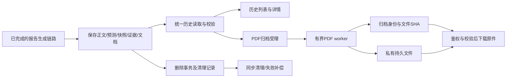

# 第 7～9 项合并核查与生产级设计

日期：2026-09-07。代码基线：`main / 7a2e3e7`。状态：**整体设计已获用户批准，详细实施计划已编写；未实施业务代码，未迁移生产数据库。**

范围：AI 操作者、脂肪肝与 AD、电脑端；衔接已经完成的附录 12 项及主流程第 1～6 项。以现有 `ReportDocument v1`、`EvidenceBundle v1`、v2 生成指纹和 PostgreSQL 持久任务为基础。

本次用户已明确两项产品决策：

1. 首次成功导出的 PDF 永久归档，此后下载同一份文件。
2. 主动删除报告时清理对应 PDF；删除病例仍保留报告与 PDF。

“永久”指报告存在期间不因缓存过期、模板升级或模型切换替换原件，不取消已有报告删除功能。不承诺修改后永远无需维护；本设计将当前可识别的生命周期、兼容、故障与上线门禁一次纳入范围。

## 1. 核查方法与结论

- 阅读 `docs/AI操作者流程核查.md`、项目规划、设计规范、第 6 项设计/计划/执行记录及 `OPERATOR_REPORT_OPERATIONS.md`。
- 核对 ORM、发布事务、任务/worker、列表/详情/下载 API、前端 store/路由/组件和既有测试。
- 本轮重新运行后端专项：**65 passed、3 subtests passed、6 warnings**；前端专项：**25 passed / 5 files**。
- 另以无数据库连接的 Python 诊断及从实际源码提取的 JavaScript 函数复现失败阶段丢失、历史匿名编号缺失、列表整行查询、列表响应竞争和偏移分页漏项。
- 第 6 项记录中的真实 PostgreSQL、浏览器和 PDF 视觉验收属于此前已记录证据；本轮没有重跑这些验收，也没有连接生产数据库。

**结论：第 7～9 项的大部分基础能力已经完成，原文 22 条旧缺口不能直接转换成 22 个开发任务。剩余工作应合并为“历史读取与审计完善 + PDF 原件归档 + 生命周期验收”。**

项目规划中的 MVP、50～200 人 Demo、远期 1000 并发是历史背景。本轮按用户要求采用生产工程设计，容量遵循现有 Linux 4 GiB 部署基线，并以实测作为开放门禁，不按远期并发规模引入新的消息中间件或对象存储平台。

## 2. 原核查条目逐项对照

### 2.1 第 7 项：保存正文、预测与输入快照

| 原缺口 | 当前判定 | 代码证据与本轮处理 |
|---|---|---|
| 7.1 模型加载失败留下 generating | 已完成核心修复 | 附录 11 和第 6 项已实现持久 job、独立 worker、租约与 sweep；复用，不重做队列 |
| 7.2 无快照哈希和统一生成标识 | 已完成 | `report_integrity.py`、`report_publication.py` 已有快照 SHA、batch、文档 SHA、v2 指纹 |
| 7.3 自由病例标签进入新快照 | 新写入已完成；历史读取有残留 | 新输入使用匿名编号；`AIReport.anonymous_case_code` 仍从当前病例关系取值，须改为历史快照投影 |
| 7.4 失败审计上下文不足 | 部分完成，必须补齐 | 固定 context 已在 job 中保存；具体失败阶段被终态覆盖，失败详情没有展示固定模型/标准及已确认的输入审计 |
| 7.5 列表没有输入摘要 | 基础已完成 | 有疾病、阶段、访视数、模型版本；仍需统一快照来源、中文展示和查询性能 |
| 7.6 sources 两份数据无一致性 | 新报告已完成 | `build_publication` 从 EvidenceBundle 派生来源并断言一致；发布重新验证，详情/PDF 验证投影；无需再加重复业务事实列 |
| 7.7 输入与模型身份分散 | 生成固定已完成；读取聚合不足 | 受理时固定 context，成功文档包含 context；失败报告需从保存 job 投影到审计 DTO，不重查 active |

新报告正文、预测、来源、证据、文档和 report/job 完成状态已经在同一事务发布。SHA-256 是一致性校验，不是防数据库高权限修改的数字签名；本期不引入签名系统。

### 2.2 第 8 项：历史查看

| 原缺口 | 当前判定 | 代码证据与本轮处理 |
|---|---|---|
| 8.1 只能查看前 20 条 | 基础已完成，稳定性不足 | 已有加载更多和去重；offset 分页在并发删除下漏项，排序无 id 决胜字段 |
| 8.2 无疾病/病例/模型摘要 | 基础已完成，身份与可读性不足 | 侧栏已展示摘要；阶段仍直接显示英文代码，匿名编号依赖当前病例 |
| 8.3 无快照展示 | 新完整文档已完成；旧版只显示简略摘要 | 新文档含全部访视/上下文；旧版应提供保存数据的只读明细折叠区，缺失不补造 |
| 8.4 前端无 input_snapshot 类型 | 已有声明，类型仍宽泛 | `Record<string, unknown>` 已存在；增加版本化解析和安全旧版视图模型，不直接强转 |
| 8.5 列表返回完整 prediction_result | HTTP 返回已修复；数据库查询仍重 | API 列表 schema 已移除大字段，但 ORM 仍读取整行全部 JSONB/正文，并可能因匿名编号触发关系查询 |
| 8.6 失败/生成中说明不足 | 部分完成 | 新任务有状态查询与中文原因；failed/cancelled 前端不读取详情，旧失败状态适配丢失错误原因 |
| 8.7 自由病例标签进入标题 | 新写入和安全标题已完成 | 保留安全回退；进一步统一所有页面/API/PDF 使用保存身份 |
| 8.8 无固定版本提示 | 部分完成 | 旧版详情/PDF有固定版本说明，新文档有技术身份；历史列表和新文档头部补一致的“生成时版本”说明 |

另外发现：导航标为“历史报告”的 `cases` 分支实际展示病例列表；真正历史报告在侧栏。此次建立独立历史工作区，使“我的病例 / 历史报告”的名称与内容一致。

### 2.3 第 9 项：下载 PDF

| 原缺口 | 当前判定 | 代码证据与本轮处理 |
|---|---|---|
| 9.1 中文字体未真实验收 | 第 6 项已有本机真实验收 | 不再写“从未验收”；目标 Linux 字体、浏览器版本和容量仍是部署门禁 |
| 9.2 长报告未逐页验收 | 第 6 项已有本机真实验收 | 执行记录包含 13～55 页样例；归档渲染流程变化后复验关键样例 |
| 9.3 无生成时模型版本提示 | 已完成 | `generate_pdf` 已构造固定模型版本说明 |
| 9.4 每次下载重新渲染 | 未完成，按用户决定升级为永久原件归档 | 当前每次调用 Playwright；新增受控归档任务和保存文件，不做可淘汰缓存 |
| 9.5 PDF 故障无阶段审计 | 未完成 | 路由仅安全统一错误；渲染器仍 `logger.exception` 且拼接异常文本；增加独立 PDF 尝试审计和安全原因码 |
| 9.6 文件名/页眉来自自由标签 | 安全标题已完成；身份来源需统一 | 不再使用旧自由标题；消除当前病例关系回填，统一快照编号与服务端下载名 |
| 9.7 标准完整溯源缺失 | 新报告已完成 | 已保存标题、发布机构/日期、版本/哈希、页码/段落/表格定位和原文；缺失元数据如实显示未记录 |

本轮新增确认：下载无跨进程并发控制、总执行期限和归档机制；计数是读后加一；下载长渲染期间数据库 Session 未主动释放；前端无下载防重与结构化错误解析；报告列表/详情/下载没有显式设置 `no-store`。

## 3. 已复现的问题与影响

| 编号 | 可重复证据 | 影响 |
|---|---|---|
| H1 | 构造 `AIReport(input_snapshot={anonymous_case_code: ...}, operator_case=None)`，属性结果为 None | 病例删除后部分列表/详情/前端文件名丢匿名编号；不是报告正文被删除 |
| H2 | 编译实际列表 ORM 查询，SELECT 包含 content、prediction_result、input_snapshot、report_document、evidence_snapshot | 网络返回轻量不能代表数据库/应用内存负担轻量 |
| H3 | 实际 `fetchReports` 函数先发 A/B，请求 B 先返回，再返回 A，最终列表被 A 覆盖 | 刷新/翻页/生成后刷新竞争会显示旧结果；还需账号切换隔离 |
| H4 | 首批读取 ID 60～41，另一标签删除 ID 60，再 offset=20 读取，ID 40 被跳过 | 超过 20 条可以加载，但不保证找齐 |
| H5 | `_terminal` 对原 phase=standard_evidence 的失败任务写 phase=terminal、report.error_stage=generation | 历史里无法还原已记录的具体失败阶段 |
| H6 | 无 job 的旧 failed 报告已有 error_stage/error_message，状态适配仍返回 error_code=None、message=历史报告 | 现有前端只读状态路径丢掉旧失败原因 |

代码还确认两点，不将它们夸大为已做真实并发验收：并发下载读后加一存在丢计数条件；历史字段序列化先于完整性校验，畸形旧数据可能无法进入受控错误投影。实施时补真实 DB 竞争和畸形行测试。

## 4. 方案比较与推荐

| 方案 | 收益 | 代价/边界 |
|---|---|---|
| A：修列表 + 同步渲染并保存 PDF | 改动较小 | 首次导出仍绑定 HTTP 生命周期，长报告/重启/多进程协调难处理，不推荐作为本次最终方案 |
| **B：完善历史读取 + PostgreSQL PDF 归档任务 + 受限渲染子进程** | 复用现有数据库和进程监督经验，归档可恢复，文件身份/删除/备份可追溯 | 增加归档元数据、尝试记录、清理任务和一个 worker，推荐 |
| C：新消息中间件 + 分布式对象存储/完整文档平台 | 适合多节点大规模运行 | 目前部署规模没有相应证据，运维复杂度过高；保留存储接口以便未来迁移 |

推荐 B。报告生成任务和 PDF 归档任务使用不同业务表与状态，复用有界连接、租约、条件发布和进程监督基础设施；不把 PDF 状态塞进 `ai_reports.status`，也不把现有报告生成 worker 改成难以隔离的通用任务平台。



## 5. 保存与历史读取合同

### 5.1 保留现有事实源

- `input_snapshot` 是输入事实源，`EvidenceBundle` 是证据事实源，`ReportDocument` 是完整报告展示事实源；`content` 为已保存正文，历史不重新生成正文。
- 不为“字段分散”新增第二份完整 context 或预测结果。通过读取 DTO 聚合 report、document 和 job 中保存的事实。
- 发布继续使用 `build_publication` 与现有原子终态；来源仍由 EvidenceBundle 派生，不引入第三套来源编辑入口。
- PDF 的 hash、下载次数、尝试记录等运行元数据放独立表，不加入原报告生成指纹，也不因下载更新报告内容/生成完成时间。

### 5.2 统一只读服务

新增 `report_read_service.py` 及 `report_read_models.py`，供列表、详情、归档受理、下载校验共同使用。

身份规则：只读取报告自身保存快照；新文档 identity 与快照编号/疾病/batch/report_id 必须一致。旧版有合法快照编号则使用；缺失/格式非法则回退 `报告-{id}`。任何历史接口均不访问 `operator_case` 补编号/人口学，不使用旧自由 `title/query/patient_label` 作展示身份。

新的完成报告先做结构、指纹和身份一致性校验，再生成对外 DTO。invalid 只返回授权范围内的安全身份、状态、原因及恢复提示，正文/预测/来源/图表投影为空，禁止下载；不再靠前端单独遮蔽原始无效内容。未知文档或指纹版本失败关闭。

旧报告按原算法验证；缺少旧哈希标为 unverifiable，允许查看已保存内容，显示“历史资料未完整保存，无法验证完整性”。不补签、不回写、不重新解析标准。畸形字段使用明确的受限状态，不能把所有格式错误都当作正常旧版。

失败/取消报告不是完成报告，不能因为没有最终指纹就宣告“正文损坏”。对已保存输入 SHA 和 job context SHA 分别验证，返回 `snapshot_integrity`、`context_integrity` 与 `publication_status=not_published`；已知坏快照不作为可信输入展示。

列表/详情/状态/归档状态/下载及相应敏感错误响应设置 `Cache-Control: private, no-store`，继续使用 Bearer 鉴权和统一越权 404。

### 5.3 稳定且轻量的历史列表

- 采用 `(created_at DESC, id DESC)` keyset 游标；首次一页 20 条，最大 100。返回 `items/next_cursor/has_more`，终止由 has_more 决定，不依赖变化中的 total。
- 游标带版本、上一页最后 `(created_at,id)`、查询条件摘要与所有者作用域，服务端验签/校验格式；每页仍独立按当前用户鉴权，游标不具备授权能力。
- 跨页不保持长数据库事务。新创建报告在刷新第一页后出现；删除已读项不会使未读旧项跳过。同时间的报告由 id 确定唯一顺序。状态筛选的成员随状态变化，界面通过显式刷新取得新集合，不宣称跨多页是严格数据库快照。
- 提供疾病、匿名编号、生成时间范围、报告状态筛选。日期筛选按 Asia/Shanghai 用户日界转换为 UTC 半开区间；报告生成时间与访视日期分开。匿名编号使用精确匹配，避免搜索任意自由病情文本。
- SQL 显式选择轻量列及所需 JSON 标量，绝不 SELECT 完整报告 ORM。访视数以类型检查后的 JSON 数组长度读取；失败模型版本取保存 job context。无关联病例查询，无 N+1。
- 基础复合索引 `(user_id, analysis_type, created_at DESC, id DESC)`；匿名编号筛选采用与快照解析一致的受控表达式索引；病种/状态专用索引依据真实 EXPLAIN/规模验收增补，避免预建无用途索引。
- 旧 offset 接口保留迁移期兼容，但实现也必须选轻量列且唯一排序；新前端统一用游标。升级窗口及旧入口撤除条件写入运维手册。
- 列表显示匿名编号、报告编号、完整年月日时间、病种、中文基线阶段、访视数、报告状态、生成时模型版本、PDF 状态。列表无需逐份重新计算大文档指纹；完整性标记不得伪装为本次已验证。

### 5.4 前端职责

- 建立明确的 `cases/history/report` 工作区；新建病例与我的病例沿用现有表单，历史报告进入报告列表。
- 新 `report-history` store 独立管理筛选、游标、首屏/翻页 loading、错误和请求 epoch。旧响应、旧账号响应、已删除报告响应均不能复活数据。
- 翻页失败保留已加载列表和原游标，可重试；筛选切换才清页；阅读报告后返回保留筛选和滚动位置。新报告完成提示可刷新，不自动把用户已读到的历史列表重置成前 20 条。
- 完成报告、失败报告、取消报告均可查看各自保存详情；运行报告显示状态和受理快照，不展示不存在的预测结论。
- 旧版 UI 不再根据 `visitCount >= 3` 衍生“数据够用”。显示“保存了 N 次访视；旧版未保存逐模型充分性审计”，不重算医学结论。旧版快照明细保留零值、False、单位、日期和上下文，未知字段用安全文本展示。
- 所有新 UI 遵循 `docs/DESIGN_SPEC.md` 全部规范，复用暖杏蓝、260/64px 侧栏、56px 顶栏、880px 内容区、44px 交互区域和现有 CSS 变量。

## 6. 失败审计补齐

1. job 增加 `last_execution_phase`、`failure_phase`；进入 terminal 前保存真实阶段，不再只写 `generation`。取消、排队超时和无阶段记录分别有明确语义，不猜测模型已执行到何处。
2. 保留当前 child error 消息中的 phase，经白名单和单调阶段校验传回父进程，终态事务记录；租约失效后返回的信息不能改写终态。
3. 增加受限、版本化任务审计事件：`phase_entered/input_prepared/invocation_started/task_finished/evidence_resolved/terminal`。每事件含 report/batch、序号、阶段、任务、数据库时间、安全原因、字段状态及 frame hash；不存原指标值/备注/路径/traceback。
4. 输入审计基于现有 `InputAuditCollector` 边界产生，父进程校验并持久化可确认的 checkpoint。通过唯一 `(report_id, event_seq)` 和有效 lease token 防重复/过期写；拟定每报告最多 256 事件、单事件最多 256 KiB/1024 个字段状态、全部事件合计最多 8 MiB。实施时验证现有两病种最大输入满足这些上限，超出落协议错误，不能无界写日志。
5. 异常强杀可能使最后一个事件来不及持久化；详情显示“截至最后确认阶段”，未收到 task_finished 是“结果未确认”，不能写“肯定未调用”。失败报告不凭当下模型补跑输入审计。
6. 详情返回安全 `generation_audit` 投影：受理/开始/结束时间、batch、固定模型与标准身份、最后阶段、失败原因、已确认任务审计。原有报告正文与完成指纹不变。
7. 旧报告没有 job 时，只映射已保存且白名单允许的 error_stage/error_message；未知自由文本显示通用说明，不直接输出内部异常。新迁移不补造历史阶段和事件。

## 7. PDF 原件归档合同

### 7.1 API 与操作者体验

| 接口（拟定） | 语义 |
|---|---|
| `POST /operator/reports/{id}/pdf-archive` | 明确请求准备原件；完成报告、权限与完整性校验通过后受理；已有 ready 返回同一原件元数据，已有活动任务返回同一任务；不重复渲染 |
| `GET /operator/reports/{id}/pdf-archive` | 只读归档状态，返回 not_requested/queued/rendering/ready/failed/missing/corrupt，安全阶段和可重试性 |
| `GET /operator/reports/{id}/download` | 只下载 ready 原件；未准备返回稳定错误，引导前端先受理；不能在 GET 中偷偷创建渲染任务 |
| `POST /operator/reports/{id}/pdf-archive/retry` | 只允许尚无已发布原件的失败尝试；显式幂等 key，创建下一次尝试；missing/corrupt 不可用此接口覆盖 |

新前端按钮：“准备 PDF”→“正在准备，可离开页面”→“下载 PDF”。同一 reportId 的准备和下载防重；刷新重读服务器状态，轮询 2/5/10 秒退避并遵守 Retry-After，关闭页面不取消归档。没有新 SSE 必要，复用经过验证的状态查询模式。

下载失败解析 `{code,message}`，避免 `Error([object Object])`；文件名用服务端安全 Content-Disposition，回退 `report-{id}.pdf`。下载期间按钮 loading，切换报告/注销停止客户端请求并丢弃旧响应，浏览器收到文件不等于服务器可以证明用户已保存到本机。

旧下载客户端的行为变化与前端同期发布。兼容期至多返回“PDF 尚未准备”及受理入口，不能保留旁路同步重渲染。UI 禁止下载并不替代服务端状态/所有权/完整性检查。

### 7.2 数据与存储边界

新增独立数据：

- `report_pdf_archives`：每报告唯一归档身份，FK 报告；状态/revision、源报告身份及 source hash、归档版本、固定 renderer manifest hash、已发布文件 SHA/长度/页数/归档时间、当前 attempt 与安全错误。
- `report_pdf_attempts`：归档尝试记录，含 attempt_id、状态、阶段、租约 token/截止、运行总截止、起止时间、原因码、预留对象 key。首次成功后不允许新渲染尝试替换 ready 文件。
- `report_generation_audit_events`：第 6 节中受限的生成审计事件，与 PDF 尝试审计分开。
- `report_file_cleanup_tasks`：持久化删除补偿，不随报告/账号外键级联消失；只保存待删除对象 key、任务身份、重试时间及状态，不保存病情文本。

ready 必须具备文件身份、完整 SHA、正长度、页数和归档时间；每份报告至多一个活动尝试和一个已发布原件，通过唯一约束/部分索引和条件发布共同保护。故障状态与报告 completed 正交。

存储首版使用独立私有持久目录，由配置 `REPORT_ARCHIVE_ROOT` 指定，默认位于部署持久数据卷，不放 Git、临时目录或公开 `/uploads` 路径。相对 object key 由服务端 UUID/report id 生成，不包含自由标题、病种、姓名或客户端路径。解析、写入、读取、删除均校验真实路径位于 root，拒绝路径穿越/符号链接越界。

存储接口只暴露 `write_candidate/read_verified/delete/exists` 等有限操作。没有业务需要时不引入 OSS；未来迁移存储须保持原件 bytes/SHA 不变，只切换受审计的存储映射。

### 7.3 首次归档及一致性

1. 受理短事务校验报告属于当前用户且 completed，使用统一 reader 验证报告；固定 source hash 与 render manifest（模板/CSS、图表适配器、字体、Playwright/Chromium 的精确版本及资源 hash）。不得只用报告 ID 作为内容身份。
2. 新报告 source identity 包含报告 ID、batch、指纹版本/值及文档 SHA；旧版额外对实际读取的保存正文/预测/快照/证据和安全身份做 export-source hash。此 hash 只能证明本次导出输入，不能补证明旧报告生成时未被修改。
3. 同一事务创建 archive/attempt 后返回 202。数据库配额与唯一索引防跨标签/跨 Web 进程重复受理；同幂等请求重放已有任务，不因模板切换换原件身份。
4. worker 领取后，读取固定保存数据并复核 source hash，立即释放数据库事务/连接，再进入渲染子进程。渲染不能访问病例、模型、标准目录或外部网络。
5. 写入预登记的唯一候选 key，在同一持久卷内完成临时文件写入、校验、同步落盘及原子落位；记录字节 hash、长度、页数。对象从不覆盖另一个 attempt 的文件。
6. 发布短事务重锁 archive/report，验证报告仍存在、source identity 不变、租约/attempt 有效、未删除、未过期且无已发布原件；条件写 ready 和不可变文件身份。落库成功前任何客户端都不能下载候选文件。
7. 文件写好但事务未成功，属于未发布候选，恢复先读取数据库事实；提交结果不确定绝不立即生成新文件覆盖。无引用候选按预登记 key 和租约/墓碑核对后清理，不能按文件修改时间粗暴删除。
8. ready 后即使客户端断线未收到文件，也已经形成归档原件；下次下载同一 SHA。模板升级只影响尚未受理的首次归档，不影响已有任务固定 manifest，更不影响 ready 文件。
9. 下载先做所有权/报告存在/报告完整性/source identity 检查，再打开并校验文件长度/SHA；同一打开句柄用于返回，避免校验后换文件。这里重读保存数据是验证，不是重新预测或重新生成正文。

### 7.4 不可恢复与恢复语义

- 首次发布前渲染失败可由用户显式重试，保留每次失败原因；服务器不在后台无界重复启动 Chromium。
- ready 文件缺失标 missing，hash 不符标 corrupt，立即停止下载并告警；归档的原 SHA、时间和源身份保留，不自动重渲染。
- 恢复只能从备份取回同 hash 文件，校验成功后恢复 ready；无法找回时诚实显示“归档原件不可恢复”。重新生成软件报告必须作为新报告，由正常病例流程重新受理，不能伪装为原件恢复。
- 后来发现源报告完整性不通过，即使归档文件自身 hash 正确，正常下载也停止；不能通过命中归档绕过报告完整性限制。
- 本期不提供“升级 PDF 版式覆盖原件”入口，也不承诺 PDF/A、电子签名、临床证明或跨环境重渲染字节相同。

### 7.5 有界执行与字体

- 独立 PDF worker，首版全局渲染并发 1、队列上限 20、每用户待处理上限 2；这些是拟定初值，必须通过目标主机容量验收，不冒充实测承诺。
- 拟定排队期限 600 秒、总渲染期限 120 秒、租约 45 秒、心跳 10 秒、巡检 15 秒。阶段包括 source_validation、html、browser_launch、fonts、print、storage、publish；独立 watchdog 负责总截止并杀死整个进程树。
- 独立 sweep 处理超时/失租，数据库连接与语句/锁/池等待沿用有界规则。只靠 `set_content(timeout=30000)` 不能控制完整的渲染周期。
- 字体随受版本控制的渲染资源发布，记录授权和 hash。使用字体加载完成条件并检查必需中文字体，不继续用固定等待 500ms 表示字体准备好。正文和页眉/页脚使用同一受控字体资源；固定打印 CSS 与 Chromium 版本。
- 拦截浏览器远程请求，只允许服务提供的内联或明确本地资源；白名单清洗仍保留。HTML准备、Jinja模板和Playwright各阶段异常统一转换为安全代码。
- 普通日志仅 report/archive/attempt id、阶段、安全原因和耗时。删除 `logger.exception`、title 自由文本及原异常拼接；需要诊断的浏览器输出也必须受限清洗，不把完整 stderr 直接持久化。
- PDF worker 与已有模型 worker 各自并发 1 仍可能同时占内存。必须联合 PostgreSQL/Web/BGE/RAG 等测量，配置 cgroup/进程树资源上限；4 GiB 主机不够时选择同一重任务资源槽串行执行或扩容，再开放归档，不能单靠各自单并发宣称容量安全。

## 8. 下载计数、删除与备份

### 8.1 下载计数

新归档的访问计数与审计独立于报告内容。使用数据库原子增量；为每次已授权且原件校验通过的文件响应创建 delivery id，并在同一短事务写审计与计数。提交响应不确定时按 delivery id 查询，不能重复加一。

计数定义为“服务器接受的文件交付次数”，不称为“用户成功保存次数”；浏览器断线可能发生在服务器发出响应后。客户端重复下载产生新交付是合理计数，不因此重渲染。旧 `download_count` 保留历史基数，新值由兼容 DTO 聚合，避免下载继续改变 `AIReport.updated_at`。

### 8.2 删除

- 删除病例：只清理病例/访视，报告与归档独立保留；所有读取都不依赖病例关系。
- 删除报告：保留原所有权与 generating 禁删规则；报告已 completed 但 PDF preparing 时允许删除，在同事务撤销归档发布资格、建立待清理记录，再删除报告相关业务行。
- 数据库与文件系统没有共同事务：不能先删文件再尝试提交数据库。正确顺序是“提交报告删除与清理任务 → 本请求立即尝试清理文件”。全部清理完成可返回 204；存储暂不可用返回可识别的清理中结果，页面明确“报告已删除，文件清理中”，由持久任务补偿。不能把失败当作 PDF 已删除。
- 已删除报告立即不能被新下载/worker 发布；删除前已经返回给用户的文件和已发出的字节不能撤回。此边界在产品说明中简洁解释，不作无法兑现的删除承诺。
- 报告直接删除、账号级联删除均必须进入同一清理保障。采用归档/attempt 删除前数据库触发器写清理 outbox，可覆盖数据库 FK 级联；清理表不带会随账号删除的外键。同步 API 读取本事务关联任务并立即执行安全清理。
- 清理任务幂等；覆盖 ready、临时文件和未发布候选。防止旧 worker 在删除后再写文件：预留 key、发布存在性检查、失租进程终止和宽限后的候选复查共同保护；不得只删一次就把任务永久移除。
- 失败/取消报告没有 PDF 也可以按现有规则删除；幂等墓碑继续保留，旧 key 不复活已删除报告。

### 8.3 备份与恢复

- 原件不是缓存：不能 TTL/LRU 淘汰。磁盘不足时停止新归档、告警并保留已有文件，禁止删除旧原件腾空间。
- 数据库元数据、原件文件及 renderer manifest 纳入配套备份。首版发布门禁使用暂停归档发布/删除、排空活动写入的短窗口创建一致备份；异地副本与恢复演练必须覆盖两者。
- 每个备份集保存 report/archive/object key、SHA/长度及数据库备份身份清单。恢复后先做只读全量关联/哈希/墓碑检查，再开放下载/归档。
- 账号/报告删除同步清理在线原件；不可变备份中的旧数据按备份保留策略到期清理。恢复旧备份时应用后续删除记录，避免恢复后重新暴露已删除报告；清理记录须作为独立可恢复日志保留。
- 具体备份 RPO/RTO、保留天数及真实磁盘容量必须在部署窗口由运维环境确定并验收；它们影响运维承诺，不阻塞本轮应用合同设计，也不能用任意默认值替用户作永久保留承诺。

## 9. 文件边界与实施顺序

下表是设计级交付拆分；用户已批准整体设计，详细任务见[总实施计划](../plans/2026-09-07-operator-report-history-pdf-implementation.md)及其三个模块计划。本轮不写业务实现，本表保留为设计与实施任务的对照。

| 顺序 | 可验收交付 | 主要文件 |
|---|---|---|
| A1 | 统一保存身份/完整性/旧版读取合同 | 新 `backend/app/services/report_read_service.py`、`backend/app/schemas/report_read_models.py`；修改 `db/models.py`、`schemas/operator.py`、`api/operator.py` |
| A2 | 保留真实失败阶段和已确认审计事件 | 修改 `report_job_repository.py`、`report_generation_service.py`、`report_process_control.py`、`report_worker.py`、`report_execution.py`、`report_input_audit.py`；新审计 schema/service 与迁移 |
| A3 | 轻量游标列表与真正历史工作区 | 新后端历史查询服务、前端 `stores/report-history.ts`、`components/report/ReportHistoryWorkspace.vue`；修改 `OperatorView.vue`、`OperatorSidebar.vue`、`LongitudinalReportView.vue` 和 API/types |
| B1 | 归档 schema、私有存储、幂等受理与状态 | 新 `schemas/report_pdf_archive.py`、`services/report_pdf_archive_service.py`、`services/report_archive_storage.py`、`api/operator_report_archives.py`；模型与迁移 |
| B2 | 有界 worker、固定 renderer、原件条件发布 | 新 `workers/report_pdf_worker.py`、PDF supervision/repository；改造 `pdf_generator.py`、`report_pdf.html`；受控字体/manifest 与服务配置 |
| B3 | 原件下载、交付审计、删除补偿、恢复 | 新 cleanup service/只读校验器；修改下载路由、报告删除与账号删除验证；API 下载状态适配 |
| B4 | 页面归档体验与错误恢复 | 新前端 archive API/store；下载按钮状态、鉴权清理、刷新/退避、删除清理结果 |
| C1 | 真库/故障/浏览器/PDF/容量与发布证据 | 扩充 `backend/tests/integration`、`backend/tests/e2e`、`frontend/src/**/__tests__`；更新 `docs/OPERATOR_REPORT_OPERATIONS.md`、部署手册及只读门禁 |

迁移从当前 head `0024` 后分配，执行前再次确认，不能照搬附录中的 0019/0021。同步 `database/schema.sql`，新增列保守可空兼容旧行；新记录严格约束。不得批量修改旧正文/快照/指纹或给旧报告补造归档时间。

A、B 可以形成独立模块计划，但共用身份/读取合同应先冻结；本次没有授权并行代理，实施方式后续按用户选择，不默认分派子代理。

### 发布与回滚顺序

1. 备份并只读确认实际 Alembic head、当前报告/任务状态；关闭新增归档受理，升级会影响模型审计协议时同时排空旧报告执行进程。
2. 按真实 head 顺序迁移，安装固定 renderer/字体和私有持久目录；不为已有报告批量生成归档，不改写旧正文或补造旧审计。
3. 发布理解新读模型/归档协议的 API 与前端。独立设置归档 ENABLED/ACCEPTING 开关，默认关闭受理，先启动 worker、sweep 和清理服务。
4. 只读 postflight 检查新表/索引/清理触发器、存储边界和文件关联；完成字体/双病种/故障/恢复/联合容量门禁后开放受理。已归档原件读取不依赖受理开关。
5. 回滚先关闭归档受理，排空或终止未发布尝试，保留 ready 文件/元数据、审计与清理任务。只能回滚到理解归档原件协议的兼容版本；旧同步重渲染下载入口必须保持关闭。
6. 禁止通过 schema downgrade 删除原件身份或清理记录；应用回滚与数据库降级分开。备份恢复先离线校验并应用删除记录，再恢复下载权限。

## 10. 验收矩阵与完成标准

| 门禁 | 必测场景与通过标准 |
|---|---|
| 保存回归 | 原子发布、来源不一致拒绝、report/job 终态一致、旧指纹算法、未知新版本拒绝，既有第 1～6 项不退化 |
| 身份稳定 | 病例修改/归档/停用/删除后，列表/详情/PDF/文件名只读取相同保存身份；快照缺项安全回退 |
| 列表规模 | 至少 10,000 份虚构历史报告，20/100 每页；同时间排序、插入/跨标签删除、筛选切换不漏静态剩余旧项，无 N+1，无大字段 SELECT；目标机 EXPLAIN 与 p95 耗时记录 |
| 前端竞争 | 旧请求后返回、双翻页、账号切换、列表删除响应竞争、刷新后返回阅读位置、首屏/翻页失败重试、真实历史导航 |
| 失败详情 | model_loading/prediction/standard_evidence/rendering/persistence、排队超时、强杀、取消；阶段保留，未确认事件不推断为完成；旧失败原因安全映射 |
| 完整性 | 独立篡改正文/预测/证据/文档/来源/batch/归档源身份，网页受限且下载拒绝；半成品只验证已有快照，不冒充完整报告 |
| 首次归档 | 双标签/双 API/双 worker 同报告受理只发布一个原件；新模型/标准/模板切换不影响固定任务；关闭页面不取消 |
| 原件稳定 | 多次下载 PDF SHA 相同；模板升级和进程重启后仍相同；未调用模型/标准/当前病例，也未再次调用 Chromium |
| 故障恢复 | 浏览器崩溃/卡死、字体缺失、磁盘满、文件落盘前后强杀、DB 提交响应丢失；有界收敛，不覆盖 completed 报告，不泄露异常 |
| 删除竞争 | 已 ready、排队中、渲染中、文件已写未发布、交付并发、账号级联删除；立即禁止新读取且候选/原件最终清理，失败可追踪 |
| 丢失/损坏 | missing/corrupt 禁止下载且不自动重渲染；备份恢复同 SHA 才 ready；无备份显示不可恢复 |
| 计数/权限 | 并发交付原子计数，提交不确定不重复加；跨操作者/admin、猜测 archive/object id 均 404；HEAD/Range 若支持必须同等鉴权，否则明确不支持 |
| PDF实物 | 两病种正常、10 次访视全指标、长上下文、10×30 展示压力、旧版、部分模型失败；中文字体嵌入、页眉、表格重复表头、长原文分页、零值/False、真实日期图、无裁切 |
| 资源/运维 | 目标 Linux 4 GiB 联合模型/PDF/DB/Web/RAG 压测；记录峰值、队龄、超时、磁盘；服务监督/sweep/备份恢复/清理重试确实运行 |

普通本地读取目标建议 p95 < 1 秒，首次正常 PDF 准备目标 p95 < 30 秒，总期限 120 秒；它们是验收目标，需在目标硬件、指定数据量下校准。未达到时先优化/串行化/扩容，不能以降低证据完整性或裁剪保存正文通过门禁。

最大输入业务校验仍保持 1～10 次访视、每次最多 30 指标，实际疾病目录可能不足 30；10×30 是展示压力夹具，不放宽业务准入。模型用途与 AD evidence-only 语义保持原合同。

**第 7 项完成条件**：现有原子保存不退化，历史身份纯保存读取，失败阶段/上下文/已确认审计可追溯。

**第 8 项完成条件**：全部历史可稳定分页定位，列表真轻量，完成/失败/取消详情完整，旧版和账号切换安全。

**第 9 项完成条件**：首次原件归档、后续相同 bytes、独立审计/有界资源、删除与恢复闭环、目标环境 PDF 实物验收通过。

仓库、本机隔离验收、生产上线分别记录；生产迁移、真实容量或恢复演练缺一，不标记生产完成。

## 11. 本轮验证命令

根目录：

```powershell
python -m pytest backend/tests/test_longitudinal_report_persistence.py backend/tests/test_report_integrity.py backend/tests/test_report_document_integrity.py backend/tests/test_operator_catalog_and_reports_api.py backend/tests/test_report_generation_service.py backend/tests/test_report_generation_sse.py backend/tests/test_pdf_generation.py backend/tests/test_longitudinal_pdf_contract.py backend/tests/test_report_document_pdf.py backend/tests/test_report_evidence_presentation.py -q --tb=short
```

结果：65 passed、3 subtests passed、6 warnings，17.86 秒。警告是既有 Pydantic/FastAPI 弃用提示和篡改测试的 UUID 类型提示。

frontend 目录：

```powershell
npm run test:unit -- src/components/__tests__/LongitudinalReportView.spec.ts src/components/__tests__/ReportDocumentView.spec.ts src/stores/__tests__/report-generation.spec.ts src/stores/__tests__/operator-case-workspace.spec.ts src/views/__tests__/OperatorView.spec.ts
```

结果：25 passed / 5 files。额外诊断均未连接数据库；并发 DB、浏览器和 PDF 真文件验证必须在本设计实施后执行，不能拿本次 65/25 作为未来实现通过的证据。

## 12. 官方技术依据

- PostgreSQL 要求 LIMIT 分页使用唯一确定的排序，大 OFFSET 仍需计算跳过行；本设计据此采用时间/id 游标和实测查询计划。[PostgreSQL 18 LIMIT/OFFSET](https://www.postgresql.org/docs/18/queries-limit.html)
- `SKIP LOCKED` 适合队列消费者而非普通一致性查询；只用于任务领取，不用于历史列表。[PostgreSQL 18 SELECT](https://www.postgresql.org/docs/18/sql-select.html)
- PDF 渲染使用打印样式，页眉/页脚有独立限制，应单独验证受控字体与排版。[Playwright Page PDF](https://playwright.dev/python/docs/api/class-page#page-pdf)
- 字体加载可以等待 `document.fonts.ready`；仍需验证具体字体可用，等待完成不能证明任意字体已安装。[MDN Document.fonts](https://developer.mozilla.org/en-US/docs/Web/API/Document/fonts)

## 13. 设计审阅

已确认：PDF 首次成功原件永久保存；主动删除报告同步清理原件，病例删除保留历史。

用户已明确“设计通过，开始编写实施计划”。方案 B、失败审计扩展、历史工作区、私有持久目录、删除失败的持久补偿、迁移/备份/容量门禁已获整体批准。详细任务见[总实施计划](../plans/2026-09-07-operator-report-history-pdf-implementation.md)，当前授权为编写计划；不表示业务实现已完成或生产部署已授权。
